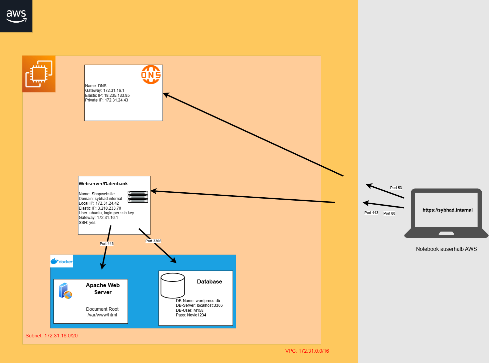

# Projektdokumentation – M158 LB2 <br>WordPress-Migration

## Übersicht
# Projektdokumentation – Webserver-Projekt

Diese Dokumentation ist nach den Aufgaben (1–14) gegliedert. Jede Aufgabe ist in drei Phasen unterteilt. Bitte tragen Sie Ihre Ergebnisse jeweils unter den entsprechenden Abschnitten ein.

---

## Aufgabe 1 – Projektplan erstellen


### Stufe 3


---

## Aufgabe 2 – Architekturdiagramm erstellen

### Stufe 3



[Hier](<../03 - Diverses/Architekturdiagram.drawio>) ist noch die Datei

---

## Aufgabe 3 – AWS-Umgebung einrichten

### Stufe 1

Die Instanz ist erstellt und man kann per ssh drauf zugreifen.

#### Webserver


#### DNS


### Stufe 2

Hier sieht man auch die korrekte Konfiguration von den IPs und auch Port Forwarding.

#### Webserver


#### DNS


---

## Aufgabe 4 – DNS-Konfiguration

Ändern Sie die Stufe, für die Sie sich entschieden haben, selbst.

### Stufe 3

Fügen Sie hier Ihre Ergebnisse ein

Ich habe als DNS Server Bind9 verwendet auf einer Ubuntu EC2 Instanz.

Dabei habe ich eine Zone für sybhad.internal erstellt.

die Konfiguration sieht so aus:

```
$TTL 604800
@   IN  SOA dns.sybhad.internal. admin.sybhad.internal. (
            2025061301 ; Serial
            604800     ; Refresh
            86400      ; Retry
            2419200    ; Expire
            604800 )   ; Negative Cache TTL
@   IN  NS  dns.sybhad.internal.
dns IN  A   3.87.81.158
@   IN  A   3.218.233.70
```

Hier sieht man wie es korrekt resolved


---

## Aufgabe 5 – Webserver konfigurieren

### Stufe 2

Hier sieht man meine V-Host config. Dort ist ssl aktiviert.

```apache
<VirtualHost *:443>
    ServerName sybhad.internal
    DocumentRoot /var/www/html

    SSLEngine on
    SSLCertificateFile /etc/ssl/certs/fullchain.pem
    SSLCertificateKeyFile /etc/ssl/private/privkey.pem

    <Directory /var/www/html>
        Options Indexes FollowSymLinks
        AllowOverride All
        Require all granted
    </Directory>

        # Client-Caching für statische Dateien
    <IfModule mod_expires.c>
        ExpiresActive On
        ExpiresByType image/jpg "access plus 1 month"
        ExpiresByType image/jpeg "access plus 1 month"
        ExpiresByType image/gif "access plus 1 month"
        ExpiresByType image/png "access plus 1 month"
        ExpiresByType text/css "access plus 1 month"
        ExpiresByType application/javascript "access plus 1 month"
        ExpiresByType image/x-icon "access plus 1 year"
        ExpiresDefault "access plus 2 days"
    </IfModule>

        ErrorLog /var/log/apache2/m158_error.log
        CustomLog /var/log/apache2/m158_access.log combined


</VirtualHost>

<VirtualHost *:80>
    ServerName sybhad.internal
    Redirect permanent / https://sybhad.internal/
</VirtualHost>
```

### Stufe 3

Hier ist auch noch die https weiterleitung

```apache
<VirtualHost *:80>
    ServerName sybhad.internal
    Redirect permanent / https://sybhad.internal/
</VirtualHost>
```

Hier sieht man auch wie man per https auf die Webseite zugreifen kann.

Und die standard-Seite ist auch weg.  


---

## Aufgabe 6 – PHP einrichten

### Stufe 1

Fügen Sie hier Ihre Ergebnisse ein

### Stufe 2

Fügen Sie hier Ihre Ergebnisse ein

### Stufe 3

Fügen Sie hier Ihre Ergebnisse ein

---

## Aufgabe 7 – MySQL/MariaDB aufsetzen

### Stufe 2

Hier sieht man alle Nutzer der Datenbank.

Root ist nur von localhost erreichbar.

Für Wordpress hat es den dezidierten Benutzer M158

```mysql
+------------------+-----------+
| user             | host      |
+------------------+-----------+
| M158             | %         |
| root             | %         |
| mysql.infoschema | localhost |
| mysql.session    | localhost |
| mysql.sys        | localhost |
| root             | localhost |
+------------------+-----------+
```

---

## Aufgabe 8 – Web-Datenbanktool (phpMyAdmin/Adminer)

### Stufe 1

Hier sieht man das phpmyadmin läuft mit meiner Domain.


### Stufe 2

Fügen Sie hier Ihre Ergebnisse ein

### Stufe 3

Fügen Sie hier Ihre Ergebnisse ein

---

## Aufgabe 9 – FTP-Zugang einrichten

### Stufe 1

Fügen Sie hier Ihre Ergebnisse ein

### Stufe 2

Fügen Sie hier Ihre Ergebnisse ein

---

## Aufgabe 10 – WordPress migrieren

### Stufe 1

Fügen Sie hier Ihre Ergebnisse ein

### Stufe 2

Fügen Sie hier Ihre Ergebnisse ein

### Stufe 3

Fügen Sie hier Ihre Ergebnisse ein

---

## Aufgabe 11 – Backup-Konzept umsetzen

### Stufe 1

Fügen Sie hier Ihre Ergebnisse ein

### Stufe 2

Fügen Sie hier Ihre Ergebnisse ein

---

## Aufgabe 12 – Testing der Webapplikation

### Stufe 1

Fügen Sie hier Ihre Ergebnisse ein

### Stufe 2

Fügen Sie hier Ihre Ergebnisse ein

### Stufe 3

Fügen Sie hier Ihre Ergebnisse ein

---

## Aufgabe 13 – Deployment automatisieren

### Stufe 1

Fügen Sie hier Ihre Ergebnisse ein

### Stufe 2

Fügen Sie hier Ihre Ergebnisse ein

### Stufe 3

Fügen Sie hier Ihre Ergebnisse ein

---

## Aufgabe 14 – Docker verwenden

### Stufe 1

Fügen Sie hier Ihre Ergebnisse ein

### Stufe 2

Fügen Sie hier Ihre Ergebnisse ein

### Stufe 3

Fügen Sie hier Ihre Ergebnisse ein

---

